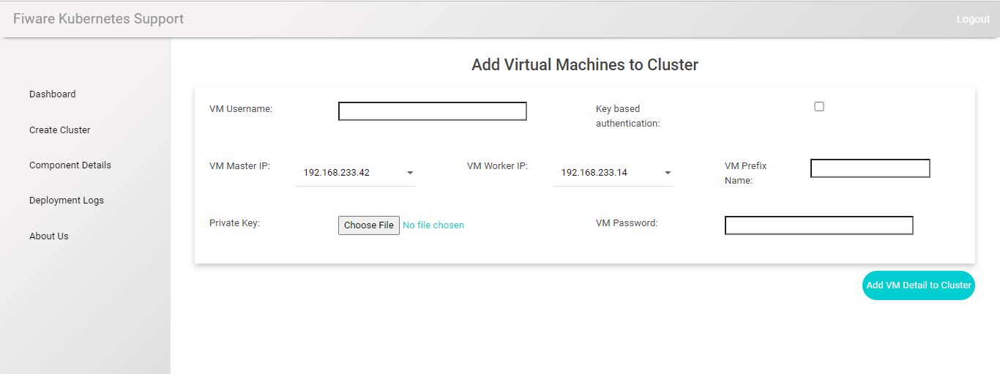

Steps to deploy Fiware GE using kubernetes support in UI
----------------------------------------------
**Prerequisite:** User can go through user guide to understand how to access UI dashboard from Fiware Lab Dashboard. 

**Dashboard:** After the user gets redirected, the default screen will be Dashboard which will list all the clusters created from the user account. 

.. figure:: source/figures/dashboard.png
   :align: center
   :width: 100px
   :height: 100px
   :scale: 50 %   

**Create Cluster:** User will get option to create his own cluster in "Create Cluster" tab. User needs to fill the details which will be used for creating cluster.

.. figure:: source/figures/create-cluster.png
   :align: center
   :width: 100px
   :height: 100px
   :scale: 50 %

**Cluster List:** User will get option to list all the created cluster in "Dashboard" tab. User can click on the ID to check and modify the cluster details.

**Cluster details:** Once user clicks on the ID to check and modify the cluster details, they will get the option to add node, add component and start deployment.

**Add Node:** User can add node details in "Add Node" option after clicking on the ID shown in the Dashboard. User need to provide details such as VM username (centos/ubuntu), VM IP (internal IP), pem file to access the VM and after submitting the information, VM details will be added to the cluster.

**Add Components:** User can add Fiware GEs to the cluster by using "Add Components" option after clicking on the ID  shown in the Dashboard. User can select the components which he needs in the cluster by selecting the Enable option. User can also select the version of the Fiware GEs and its database version from the dropdown. After submitting the details, Fiware GEs will be added to the cluster.

.. figure:: source/figures/add-component.png
   :align: center
   :width: 100px
   :height: 100px
   :scale: 50 %

**Deployment logs:** User will get the option to check the deployment logs based on the cluster and deployment under "Deployment Logs" tab. For this, user need to select Cluster name from the "Cluster List" and deployment from "Deployment List" and then the logs will appear on the screen.

.. figure:: source/figures/deployment-log.png
   :align: center
   :width: 100px
   :height: 100px
   :scale: 50 %

**Deployment Details:** Once the cluster in deployed, user can check the details of the deployed cluster on the master node. The user will also get the endpoint of the Fiware GEs deployed on the cluster page. 

This is how users can create, manage cluster and deploy Fiware GE of their choice with a single click. 
