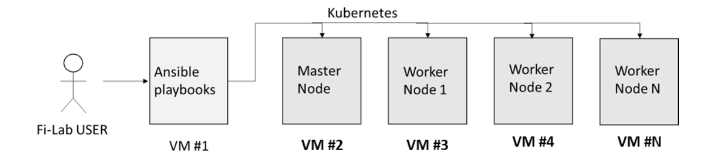
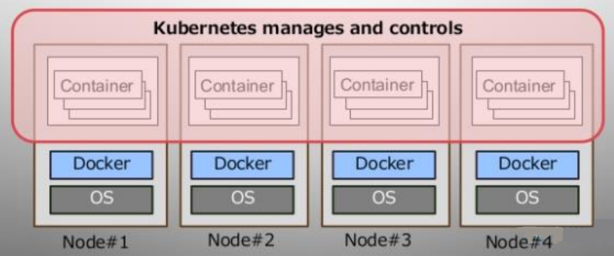
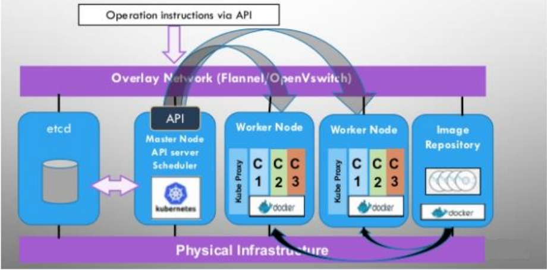
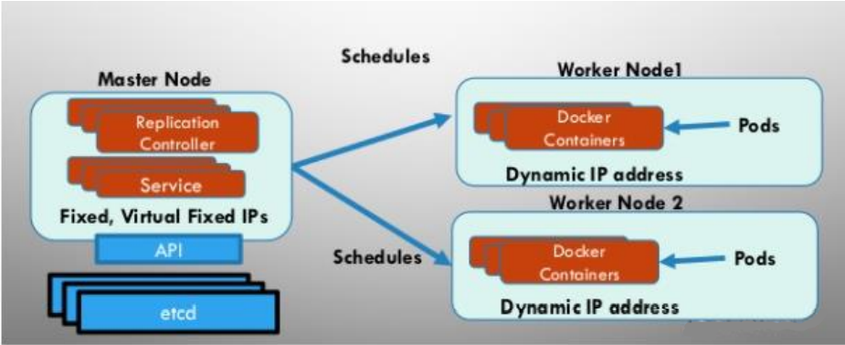

************************************
Kubernetes Integration
************************************

Kubernetes is a portable, extensible, open-source platform for managing containerized workloads and services, that facilitates both declarative configuration and automation. It has a large, rapidly growing ecosystem. Kubernetes services, support, and tools are widely available. Production grade system uses the K8s to attain its functionality benefits. Most of the Fiware GE supports K8s and migrated to it. 

As Noida Fiware Lab provides the VM's for trail & POC usage to the users and groups. To look the popularity of K8s. We are planning to provide some Ansible books to automated deployment of K8s cluster to provided VM's (centos and ubuntu). This has been tested and verified on Centos 7.9 64 bit operating systems with Kernel 5.12.10-1.el7.elrepo.x86_64 and Ubuntu 16.04 64 bit operating systems with Kernel Linux4.4.0-210-generic.

Along with cluster following features of K8s are implemented in:

1. **High Availability and Load Balancing**: 
High Availability is about setting up Kubernetes, along with its supporting components in a way that there is no single point of failure. If the environment setup has multiple applications running on Single container then this container can easily fail. Same as the virtual machine for high availability multiple replicas of a container can be run in Kubernetes. Load balancing is efficient in distributing incoming network traffic across a group of backend servers. A load balancer is a device that distributes network or application traffic across a cluster of servers. The load balancer plays a big role for achieving the high availability and better performance of the cluster. 

2. **Self-Healing**: 
This feature of kubernetes is what makes it best among others. If any pod gets deleted manually or accidentally, it is restared by kubernetes cluster. This maintains continuity with the deployed project. This feature of kuberenetes to heal a pod is referred as auto-heal. 

3. **Automated Rollouts & Rollback**: This can be achieved by rolling update. Rolling updates are the default strategy to update the running version of your app. With every new update cycle the previously launched Pod is removed and in its place a  newer Pod with latest updates is launched incrementally. 
When any change is introduced that breaks production, then there should be  a plan to roll back that change. Kubernetes and kubectl offer a simple mechanism to roll back changes to its resources such as Deployments.

Architecture of Fiware User VM's K8s Support through CLI
----------------------------------------------
K8s cluster would be created over provided Fiware Lab nodes and architecture would look like below.

1. Fiware-Lab user will run the Ansible-playbook by providing IP addresses of the VMs on which K8s cluster (master and Worker Nodes) needs to setup.

2. Ansible-playbook will automatically deploy docker, kubeadm and kubectl on all the node with required settings

3. Helm is automatically deployed on Master Node. Helm charts can be used to deploy Fiware GEs like Orion, IOTAgent, Fogflow, Scropio broker, etc. over the created worker Node. User can also manage the cluster by Kubernetes API server.

4. This automate script will be executed from the Ansible node and all other Fiware VMs (used for Master/Worker Node) should be accessible from this node. 

5. K8s Cluster can be deployed over variable VM's (minimum 3 VM) with user required e.g. 3VM Setup, 4VM Setup etc.

6. Basic networking would be created through flannel.

7. User can create namespace where all GE's would be deployed.

By deploying the K8s through Ansible-playbooks, user gets access to all the K8s features such as:

1. Automated rollouts and rollbacks

2. Service discovery and load balancing

3. Storage orchestration

4. Secret and configuration management

5. Automatic bin packing

6. Batch execution

7. IPv4/IPv6 dual-stack

8. Horizontal scaling

9. Self-healing

10. Designed for extensibility

Fi-Lab user can configure the cluster by modifying script file/ansible-playbook at the time of deployment. After successful deployment ofKubernetes cluster, user can manage it by API server

1. Each Fiware component can be deployed as Pod
2. Individually update and scales Pod
3. Use Services for Component Communication
4. Networking:
   I. Each Pods get Virtual IPs
   II. Ports are not shared with other Pods

