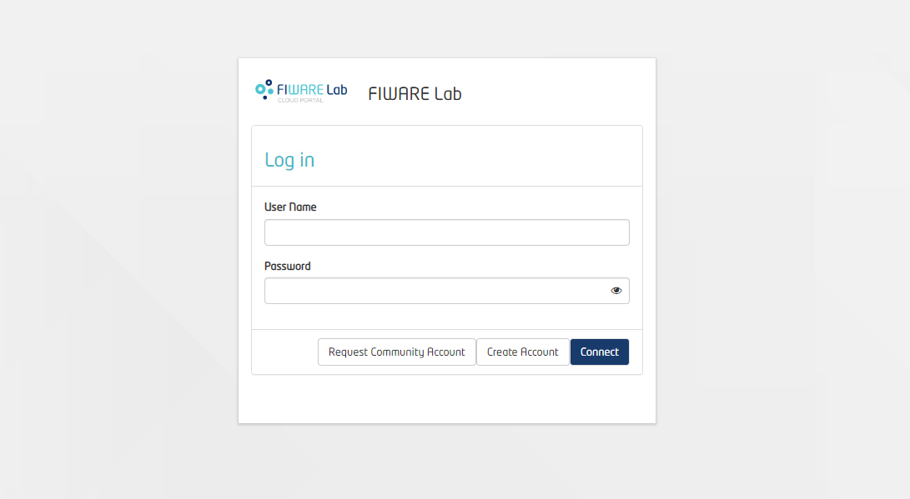
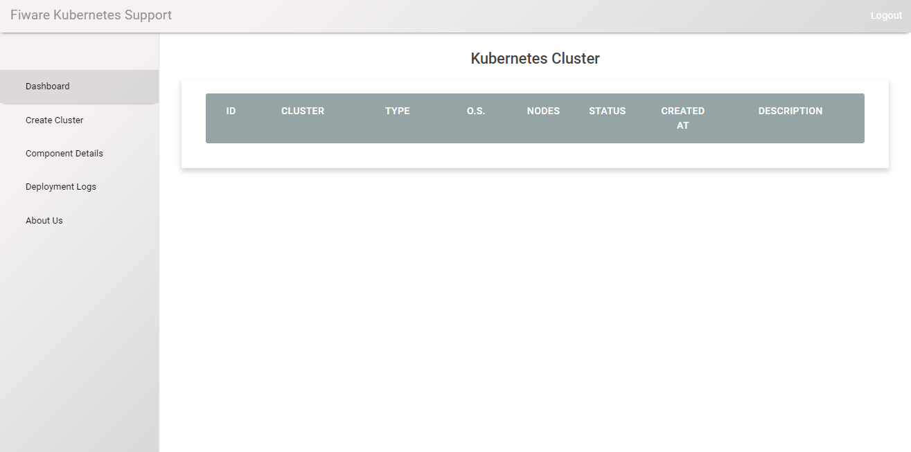
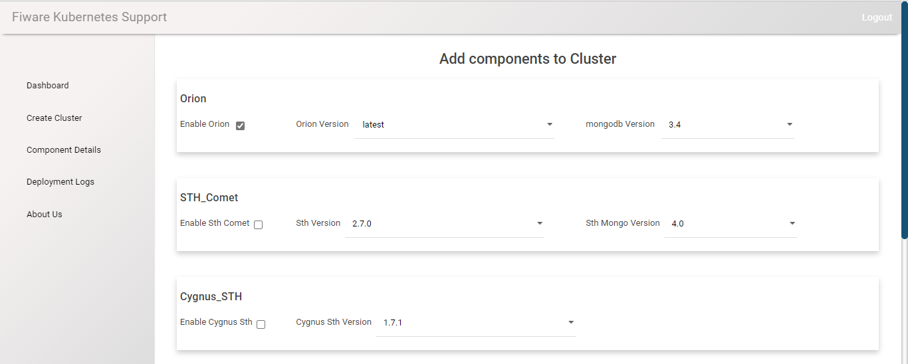

************************************
UI support to create and manage Kubernetes cluster for the user (Phase-3)
************************************

Fiware Lab user will be able to create and manage kubernetes cluster through UI. User can also deploy Fiware GEs over kubernetes cluster by selecting the GEs from the catalogue provided in GUI.

User will be provided with the code to setup flask server to enable GUI from web browser. After the setup, user can access UI through http://<VM’s Public IP>:<port number> on Web browser. User will get a login screen. For the very first time, user need to register himself through Register option and after that he can login to the server.

After successful login a Dashboard will appear where user will get options to create and manage kubernetes cluster and deploy Fiware GEs.

Pages in the GUI:
----------------------------------------------

**Register Page:** User can register himself through GUI and set password to access kubernetes cluster.

.. figure:: figures/register-page.png

**Login Page:** Only registered user can login using the username and password for accessing the kubernetes cluster.

**Dashboard:** After login, the default screen will be Dashboard which will list all the clusters created from the user account. User can click on the ID to check and modify the cluster details.

**Create Cluster:** User will get option to create his own cluster in "Create Cluster" tab. User needs to fill the details which will be used for creating cluster.

.. figure:: figures/create-cluster.png

**Components details:** User will get option to View and edit components. For this first user needs to select the Cluster name from the Cluster List and after that user can view/edit its components.

.. figure:: figures/component.png

**Add Node:** User can add node details in "Add Node" option after clicking on the ID shown in the Dashboard. User need to provide details such as VM username (centos/ubuntu), VM IP (internal IP), pem file to access the VM and after submitting the information, VM details will be added to the cluster.

.. figure:: figures/add-note.png

**Add Components:** User can add Fiware GEs to the cluster by using "Add Components" option after clicking on the ID  shown in the Dashboard. User can select the components which he needs in the cluster by selecting the Enable option. User can also select the version of the Fiware GEs and its database version from the dropdown. After submitting the details, Fiware GEs will be added to the cluster.

**Deployment logs:** User will get the option to check the deployment logs based on the cluster and deployment under "Deployment Logs" tab. For this, user need to select Cluster name from the "Cluster List" and deployment from "Deployment List" and then the logs will appear on the screen.

**Note:** UI may change to match user requirement.

**Advantages:**
1. Easier to create and manage kubernetes cluster through GUI.
2. User will be provided with option to deploy Fiware GEs through GUI.
3. User can select Fiware GEs from the catalogue and those GEs will be deployed.

**Limitations:**
1. User should be familiar with Python to run the server.
2. Mysql db is used to store user and cluster details
