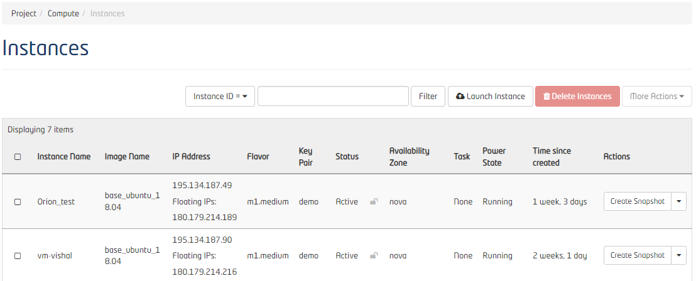
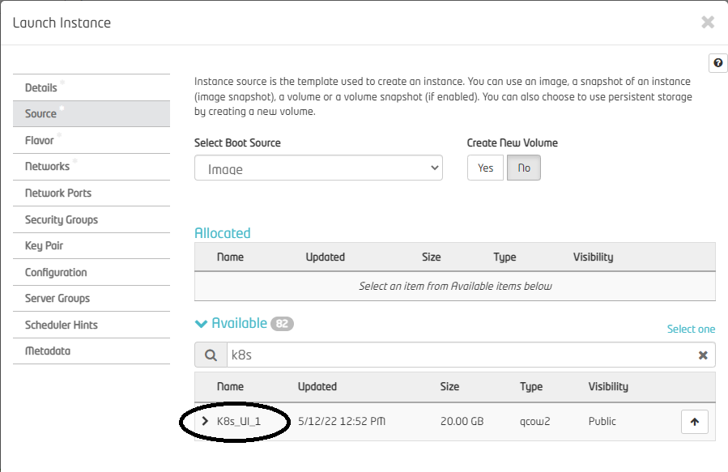

************************************
Creating a new instance with K8s UI supported Image
************************************

Steps to create a new instance from our newly created image:

1. Go to Instances page and click on Launch Instance:

2. Select the Snapshot from Source while creating a new Image:

**Note:** Make sure that the flavor of the instance booted is at least equal to or bigger than the size of the image.
